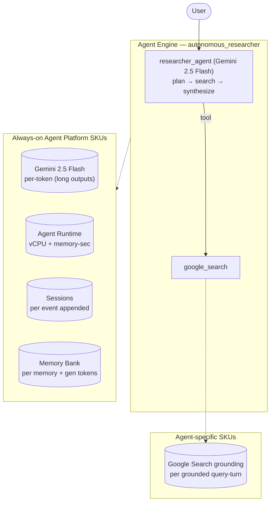

# Autonomous Researcher — SKU usage & architecture

- **Source:** google/adk-samples · **Model:** gemini-2.5-flash
- **Use case:** Deep web research with synthesis · **Complexity:** Archetype: Autonomous Researcher / Moderate
- **Unit:** 1 interaction = a 2–4-turn (varying) conversation in a single session, followed by a memory-write step (7.8 model calls on average). All numbers below are averaged over **79 interactions**. Deployed on Vertex AI Agent Engine.
- **Focus:** measured **usage per SKU**; dollar cost is a secondary derived view (§6).

## 1. Architecture

Deep-research agent (archetype: Autonomous Researcher, Moderate). It plans a query, grounds on the live web via ADK `google_search`, and synthesizes a long report. The cost profile is driven by token depth: long generated outputs (~10,700 output tokens per interaction) plus Google Search grounding (~1.6 grounded query-turns per interaction). Because a built-in tool like `google_search` must be the only tool on its agent, grounding runs in a dedicated web-research sub-agent; internal-corpus retrieval (Vertex AI Search / RAG) is light here.

**Pattern:** Single agent + Google Search grounding, long outputs

## 2. SKUs (products) consumed

Gemini tokens (long outputs); Agent Runtime (vCPU + memory); Sessions; Memory Bank; **Google Search grounding** (measured non-zero).

(Sessions and Agent Runtime are billed automatically by Agent Engine; Memory Bank generation is triggered by `add_session_to_memory`. Where the agent uses Google Search grounding or image generation, that usage is reported in §5.)

## 3. How usage was measured

Each interaction = a 2–4-turn (varying) conversation in one session, followed by `add_session_to_memory` (which triggers Memory Bank generation). We ran **79 interactions** to capture run-to-run variability, waited 300s for Cloud Monitoring metrics to settle, then read usage: token counts come from Cloud Monitoring **`token_count`** — the **complete** total. This agent delegates to sub-agents invoked as callable tools (ADK `AgentTool`), and those sub-agent model calls do not appear in the parent agent's response stream, so a stream-based count undercounts this agent by **1.1156×**; `token_count` captures every model call and corrects it; runtime (vCPU / memory-seconds) and Memory Bank usage come from Cloud Monitoring (per-engine metrics).

## 4. SKU usage per interaction (PRIMARY)

Measured usage quantities per interaction (averaged over 79 interactions), with the min–max range and variability label across interactions.

| SKU dimension | Unit | Typical | Range | Variability |
|---|---|---|---|---|
| Gemini input tokens | tokens | 32585 | 12516–122408 | High |
| Gemini output tokens (incl. thinking) | tokens | 10739 | 5728–18665 | Medium |
| Gemini tokens — coordinator agent (input) | tokens | 30880 | — | — |
| Gemini tokens — coordinator agent (output) | tokens | 8588 | — | — |
| Gemini tokens — sub-agents (input) | tokens | 1704 | — | — |
| Gemini tokens — sub-agents (output) | tokens | 2151 | — | — |
| Model calls | calls | 7.8 | — | Medium |
| Agent Runtime — vCPU | vCPU-seconds | 171.2 | — | — |
| Agent Runtime — memory | GiB-seconds | 200.6 | — | — |
| Sessions | events appended | 15.6 | — | Medium |
| Memory Bank — generation | tokens | 7999 | — | — |
| Memory Bank — memories written | memories | 0.6 | — | — |
| Memory Bank — retrievals | reads | 0.4 | — | — |
| Firestore — document writes | writes | 1.34 | — | — |
| Firestore — document reads | reads | 2.06 | — | — |
| Vertex AI Search (RAG) — queries | searches | 1.18 | — | — |
| Google Search grounding | grounded query-turns | 1.62 | — | — |

_**Coordinator vs sub-agent token split** — the share of total Gemini tokens processed by the root coordinator agent versus the sub-agents it delegates to. Measured directly by running the coordinator and the sub-agents on two different model versions (coordinator on gemini-3.5-flash, sub-agents on gemini-3.1-flash-lite) and separating their token counts by model in Cloud Monitoring — this is the **master/sub** split in the two-model measurement. The input-vs-output breakdown within each role is allocated by the measured per-role input:output ratio (coordinator ≈ 88:12, sub-agents ≈ 61:39). Single-agent agents have no sub-agents, so they are 100% coordinator._

## 5. Grounding & media usage

- **Google Search grounding:** 1.62 grounded query-turns per interaction. Grounding runs inside a dedicated web-research sub-agent that the coordinator invokes as a tool (ADK `AgentTool`); each call issues one or more native `google_search` requests and returns grounded results. We count each web-research call as one grounded query-turn — the billable unit (~$14 / 1K grounded query-turns). Native `google_search` grounding is encapsulated inside the AgentTool and is not tracked by Cloud Monitoring's `web_search_requests` metric, so the AgentTool call count is the reliable measure.
- **Image generation (Imagen):** none in this workload. (Would bill ~$0.04 / image if used.)

## 5b. Caveats on usage capture

- **Agent Runtime (vCPU / GiB-seconds)** is the engine's allocated compute amortized over the measurement window, so it depends on utilization (queries per hour). Treat it as an upper bound, not actual billed instance-time.
- **Memory storage** (the number of stored memories accruing over time) is not captured here — it is only available from the billing export.
- **Grounding** is counted from the agent's tool calls (Cloud Monitoring's grounding metric is project-wide, with no per-engine label); **Imagen** image counts come from response events.
- **Not yet captured:** Cloud Trace, Cloud Logging, Cloud Storage.

## 6. Secondary: derived cost (usage × catalog list price)

Provided for reference only. List price, not actual billed; **usage above is the primary output.**

| SKU | $/interaction |
|---|---|
| Gemini tokens | 0.0366 |
| Agent Runtime | 0.0101 |
| Memory Bank + Sessions | 0.0065 |
| Firestore (106 writes / 163 reads over 79 interactions) | 0.0000005 |
| Vertex AI Search (RAG: 1.18 queries/interaction @ $1.50/1K) | 0.001766 |
| Google Search grounding (1.62 grounded query-turns/interaction @ $14/1K) | 0.022684 |
| Memory Bank retrieval (0.38 memories retrieved/interaction @ $0.5/1K) | 0.000190 |
| Model Armor (derived: 43324 tok scanned @ $0.10/1M) | 0.004332 |
| **Total (measured SKUs)** | **0.0822** (range 0.0347–0.1000) |

## 7. Test workload & sample interactions

Each interaction used a fresh user id. The workload draws from **5 distinct conversation scenarios** of varying length (2–32 turns); real-world conversations differ in length and topic, so cycling several scenarios spreads coverage rather than repeating a single script. Longer interactions repeat these same base scenarios to exercise multi-turn cost scaling.

**Scenario 1** (2 turns):

| Turn | User query |
|---|---|
| 1 | Research the current state of small modular reactors (SMRs) and their commercial outlook. |
| 2 | Now focus on the main regulatory and cost barriers, and which companies lead. |

**Scenario 2** (3 turns):

| Turn | User query |
|---|---|
| 1 | Research the state of solid-state EV batteries in 2026. |
| 2 | Which companies are closest to mass production, and what hurdles remain? |
| 3 | Summarize the investment outlook. |

**Scenario 3** (3 turns):

| Turn | User query |
|---|---|
| 1 | Research recent advances in direct-air carbon capture. |
| 2 | Compare it with point-source capture on cost and scalability. |
| 3 | Which approach is more likely to scale this decade, and why? |

**Scenario 4** (4 turns):

| Turn | User query |
|---|---|
| 1 | Research the latest in efficient transformer architectures. |
| 2 | Which techniques work best for edge deployment? |
| 3 | How do quantization and distillation compare there? |
| 4 | Summarize the practical recommendation. |

**Scenario 5** (4 turns):

| Turn | User query |
|---|---|
| 1 | Research the RAG vs long-context-window tradeoff for enterprise search. |
| 2 | What are the cost implications of each? |
| 3 | When does hybrid (keyword + vector) retrieval help? |
| 4 | Give a recommended architecture for a 10M-document corpus. |

**Sample interaction (first run):**

- **Turn 1** (11852 in / 7672 out tokens) — user: *Research the current state of small modular reactors (SMRs) and their commercial outlook.*
  - reply preview: ## Research Report: The Current State and Commercial Outlook of Small Modular Reactors (SMRs)  ### Executive Summary  Small Modular Reactors (SMRs) are emerging as a pivotal technology in the global c…
- **Turn 2** (21136 in / 4155 out tokens) — user: *Now focus on the main regulatory and cost barriers, and which companies lead.*
  - reply preview: ## Research Report: Regulatory and Cost Barriers, and Leading Companies in Small Modular Reactor (SMR) Development  ### Executive Summary  The advancement and commercial deployment of Small Modular Re…
