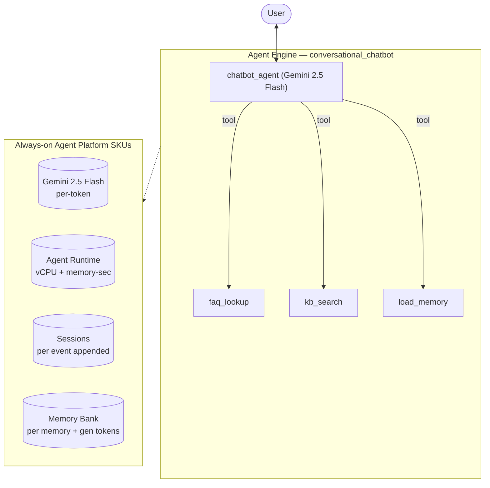

# Conversational Chatbot — SKU usage & architecture

- **Source:** google/adk-samples · **Model:** gemini-2.5-flash
- **Use case:** Customer-support Q&A chatbot · **Complexity:** Archetype: Conversational Chatbot / Moderate
- **Unit:** 1 interaction = a 2–5-turn (varying) conversation in a single session, followed by a memory-write step (7.5 model calls on average). All numbers below are averaged over **120 interactions**. Deployed on Vertex AI Agent Engine.
- **Focus:** measured **usage per SKU**; dollar cost is a secondary derived view (§6).

## 1. Architecture

Single user-facing support agent (archetype: Conversational Chatbot, Moderate). Light tool use — `faq_lookup` + `kb_search` (stand-ins for a BigQuery/KB lookup) — and `load_memory` for returning-user personalization. Volume-driven archetype: cheap model, short turns. Measured ~7.5 model calls / ~15 session events per interaction.

**Pattern:** Single agent + light tools + Memory Bank

## 2. SKUs (products) consumed

Gemini tokens; Agent Runtime (vCPU + memory); Sessions; Memory Bank. (BigQuery/KB lookup mocked locally — would bill BigQuery in production.)

(Sessions and Agent Runtime are billed automatically by Agent Engine; Memory Bank generation is triggered by `add_session_to_memory`. Where the agent uses Google Search grounding or image generation, that usage is reported in §5.)

## 3. How usage was measured

Each interaction = a 2–5-turn (varying) conversation in one session, followed by `add_session_to_memory` (which triggers Memory Bank generation). We ran **120 interactions** to capture run-to-run variability, waited 300s for Cloud Monitoring metrics to settle, then read usage: token counts come from the model's per-response `usage_metadata` (exact — this agent makes no AgentTool-hidden sub-agent calls, so the response stream already sees every model call); runtime (vCPU / memory-seconds) and Memory Bank usage come from Cloud Monitoring (per-engine metrics).

## 4. SKU usage per interaction (PRIMARY)

Measured usage quantities per interaction (averaged over 120 interactions), with the min–max range and variability label across interactions.

| SKU dimension | Unit | Typical | Range | Variability |
|---|---|---|---|---|
| Gemini input tokens | tokens | 6369 | 2030–17874 | High |
| Gemini output tokens (incl. thinking) | tokens | 693 | 185–1876 | High |
| Gemini tokens — coordinator agent (input) | tokens | 6369 | — | — |
| Gemini tokens — coordinator agent (output) | tokens | 693 | — | — |
| Gemini tokens — sub-agents (input) | tokens | 0 | — | — |
| Gemini tokens — sub-agents (output) | tokens | 0 | — | — |
| Model calls | calls | 7.5 | — | Medium |
| Agent Runtime — vCPU | vCPU-seconds | 20.9 | — | — |
| Agent Runtime — memory | GiB-seconds | 38.8 | — | — |
| Sessions | events appended | 15.0 | — | Medium |
| Memory Bank — generation | tokens | 2486 | — | — |
| Memory Bank — memories written | memories | 0.0 | — | — |
| Memory Bank — retrievals | reads | 0.0 | — | — |
| Firestore — document writes | writes | 0.03 | — | — |
| Firestore — document reads | reads | 0.00 | — | — |
| Vertex AI Search (RAG) — queries | searches | 2.15 | — | — |

_Memory retrievals = 0 for this workload. `load_memory` returns memories only when (a) the agent invokes it and (b) earlier sessions generated **user-centric** memories worth recalling. Here it is 0 — the agent has no retrieval tool, or doesn't call it (support-FAQ chatbot answers directly), or calls it but its sessions produce no user-centric memories to retrieve (e.g., academic-research: topic Q&A, not facts about the user). The retrieval SKU IS exercised by financial-advisor, marketing-agency, blog-writer, workflow-operator, autonomous-researcher, and multi-agent-orchestrator (returning-user runs) + `memory_assistant`._

_**Coordinator vs sub-agent token split** — the share of total Gemini tokens processed by the root coordinator agent versus the sub-agents it delegates to. Measured directly by running the coordinator and the sub-agents on two different model versions (coordinator on gemini-3.5-flash, sub-agents on gemini-3.1-flash-lite) and separating their token counts by model in Cloud Monitoring — this is the **master/sub** split in the two-model measurement. The input-vs-output breakdown within each role is allocated by the measured per-role input:output ratio (coordinator ≈ 88:12, sub-agents ≈ 61:39). Single-agent agents have no sub-agents, so they are 100% coordinator._

## 5. Grounding & media usage

- **Google Search grounding:** none in this workload — the agent does not call `google_search`. (Would bill ~$14 / 1K grounded query-turns if used.)
- **Image generation (Imagen):** none in this workload. (Would bill ~$0.04 / image if used.)

## 5b. Caveats on usage capture

- **Agent Runtime (vCPU / GiB-seconds)** is the engine's allocated compute amortized over the measurement window, so it depends on utilization (queries per hour). Treat it as an upper bound, not actual billed instance-time.
- **Memory storage** (the number of stored memories accruing over time) is not captured here — it is only available from the billing export.
- **Grounding** is counted from the agent's tool calls (Cloud Monitoring's grounding metric is project-wide, with no per-engine label); **Imagen** image counts come from response events.
- **Not yet captured:** Cloud Trace, Cloud Logging, Cloud Storage.

## 6. Secondary: derived cost (usage × catalog list price)

Provided for reference only. List price, not actual billed; **usage above is the primary output.**

| SKU | $/interaction |
|---|---|
| Gemini tokens | 0.0036 |
| Agent Runtime | 0.0019 |
| Memory Bank + Sessions | 0.0045 |
| Firestore (4 writes / 0 reads over 120 interactions) | 0.0000000 |
| Vertex AI Search (RAG: 2.15 queries/interaction @ $1.50/1K) | 0.003225 |
| Model Armor (derived: 7061 tok scanned @ $0.10/1M) | 0.000706 |
| **Total (measured SKUs)** | **0.0139** (range 0.0074–0.0160) |

## 7. Test workload & sample interactions

Each interaction used a fresh user id. The workload draws from **5 distinct conversation scenarios** of varying length (2–40 turns); real-world conversations differ in length and topic, so cycling several scenarios spreads coverage rather than repeating a single script. Longer interactions repeat these same base scenarios to exercise multi-turn cost scaling.

**Scenario 1** (2 turns):

| Turn | User query |
|---|---|
| 1 | How do I reset my password, and what are your support hours? |
| 2 | Also, what are your pricing tiers and do you support SSO? |

**Scenario 2** (3 turns):

| Turn | User query |
|---|---|
| 1 | I'd like a refund on my last order. |
| 2 | How long does that take to process? |
| 3 | Can it go to a different card than I paid with? |

**Scenario 3** (4 turns):

| Turn | User query |
|---|---|
| 1 | Do you integrate with Slack? |
| 2 | What about exporting my data? |
| 3 | Is data export on the Pro tier or Enterprise only? |
| 4 | Okay — how do I upgrade my plan? |

**Scenario 4** (4 turns):

| Turn | User query |
|---|---|
| 1 | My shipment hasn't arrived yet. |
| 2 | It's order ORD-1002. What's the ETA? |
| 3 | Can you switch it to express shipping? |
| 4 | Will I be charged extra for that? |

**Scenario 5** (5 turns):

| Turn | User query |
|---|---|
| 1 | I'm new — can you walk me through setting up my account? |
| 2 | How do I invite my team? |
| 3 | What roles can I assign them? |
| 4 | Do you support SSO for the team? |
| 5 | And what does all that cost on the Pro tier? |

**Sample interaction (first run):**

- **Turn 1** (963 in / 231 out tokens) — user: *How do I reset my password, and what are your support hours?*
  - reply preview: I don't have information on how to reset your password or our support hours in my frequently asked questions. Would you like me to try and find this information elsewhere, or escalate your request to …
- **Turn 2** (1743 in / 525 out tokens) — user: *Also, what are your pricing tiers and do you support SSO?*
  - reply preview: We have a free Starter tier (1 user, community support). Our Pro tier is $29/user/month and includes API access but not SSO. The Enterprise tier is custom-priced and includes SSO, SLA, and dedicated s…
