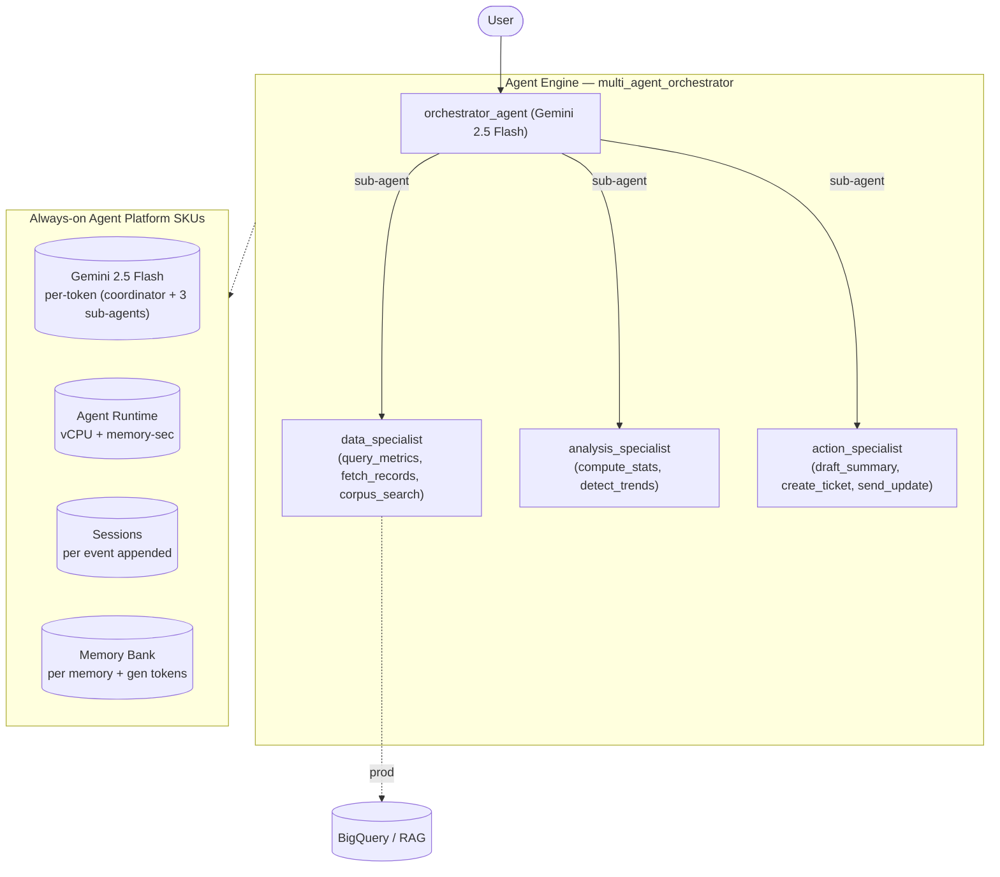

# Multi-Agent Orchestrator — SKU usage & architecture

- **Source:** google/adk-samples · **Model:** gemini-2.5-flash
- **Use case:** Decompose-and-delegate orchestration · **Complexity:** Archetype: Multi-Agent Orchestrator / Moderate
- **Unit:** 1 interaction = a 2–5-turn (varying) conversation in a single session, followed by a memory-write step (18.9 model calls on average). All numbers below are averaged over **120 interactions**. Deployed on Vertex AI Agent Engine.
- **Focus:** measured **usage per SKU**; dollar cost is a secondary derived view (§6).

## 1. Architecture

Coordinator that decomposes a request and delegates to 3 specialist sub-agents — data_specialist (metrics / records / corpus), analysis_specialist (stats / trends), action_specialist (summary / ticket / notify) (archetype: Multi-Agent Orchestrator, Moderate). Fan-out-driven and input-heavy: the coordinator re-ingests context across its sub-agents, so input tokens dominate — ~19 model calls and ~38 session events per interaction. Specialist tools are local stand-ins for BigQuery / RAG.

**Pattern:** Coordinator + 3 specialist sub-agents (agent-call fan-out)

## 2. SKUs (products) consumed

Gemini tokens (coordinator + sub-agents); Agent Runtime (vCPU + memory); Sessions; Memory Bank. (Specialist BigQuery/RAG calls mocked — would bill in production.)

(Sessions and Agent Runtime are billed automatically by Agent Engine; Memory Bank generation is triggered by `add_session_to_memory`. Where the agent uses Google Search grounding or image generation, that usage is reported in §5.)

## 3. How usage was measured

Each interaction = a 2–5-turn (varying) conversation in one session, followed by `add_session_to_memory` (which triggers Memory Bank generation). We ran **120 interactions** to capture run-to-run variability, waited 300s for Cloud Monitoring metrics to settle, then read usage: token counts come from the model's per-response `usage_metadata` (exact — this agent makes no AgentTool-hidden sub-agent calls, so the response stream already sees every model call); runtime (vCPU / memory-seconds) and Memory Bank usage come from Cloud Monitoring (per-engine metrics).

## 4. SKU usage per interaction (PRIMARY)

Measured usage quantities per interaction (averaged over 120 interactions), with the min–max range and variability label across interactions.

| SKU dimension | Unit | Typical | Range | Variability |
|---|---|---|---|---|
| Gemini input tokens | tokens | 149080 | 6076–8349717 | Very high |
| Gemini output tokens (incl. thinking) | tokens | 6080 | 1140–106637 | Very high |
| Gemini tokens — coordinator agent (input) | tokens | 25799 | — | — |
| Gemini tokens — coordinator agent (output) | tokens | 268 | — | — |
| Gemini tokens — sub-agents (input) | tokens | 123281 | — | — |
| Gemini tokens — sub-agents (output) | tokens | 5812 | — | — |
| Model calls | calls | 18.9 | — | Very high |
| Agent Runtime — vCPU | vCPU-seconds | 90.6 | — | — |
| Agent Runtime — memory | GiB-seconds | 100.3 | — | — |
| Sessions | events appended | 37.9 | — | Very high |
| Memory Bank — generation | tokens | 2793 | — | — |
| Memory Bank — memories written | memories | 1.2 | — | — |
| Memory Bank — retrievals | reads | 0.2 | — | — |
| Firestore — document writes | writes | 0.29 | — | — |
| Firestore — document reads | reads | 0.63 | — | — |
| Vertex AI Search (RAG) — queries | searches | 0.42 | — | — |

_**Coordinator vs sub-agent token split** — the share of total Gemini tokens processed by the root coordinator agent versus the sub-agents it delegates to. Measured directly by running the coordinator and the sub-agents on two different model versions (coordinator on gemini-3.5-flash, sub-agents on gemini-3.1-flash-lite) and separating their token counts by model in Cloud Monitoring — this is the **master/sub** split in the two-model measurement. The input-vs-output breakdown within each role is allocated by the measured per-role input:output ratio (coordinator ≈ 88:12, sub-agents ≈ 61:39). Single-agent agents have no sub-agents, so they are 100% coordinator._

## 5. Grounding & media usage

- **Google Search grounding:** none in this workload — the agent does not call `google_search`. (Would bill ~$14 / 1K grounded query-turns if used.)
- **Image generation (Imagen):** none in this workload. (Would bill ~$0.04 / image if used.)

## 5b. Caveats on usage capture

- **Agent Runtime (vCPU / GiB-seconds)** is the engine's allocated compute amortized over the measurement window, so it depends on utilization (queries per hour). Treat it as an upper bound, not actual billed instance-time.
- **Memory storage** (the number of stored memories accruing over time) is not captured here — it is only available from the billing export.
- **Grounding** is counted from the agent's tool calls (Cloud Monitoring's grounding metric is project-wide, with no per-engine label); **Imagen** image counts come from response events.
- **Not yet captured:** Cloud Trace, Cloud Logging, Cloud Storage.

## 6. Secondary: derived cost (usage × catalog list price)

Provided for reference only. List price, not actual billed; **usage above is the primary output.**

| SKU | $/interaction |
|---|---|
| Gemini tokens | 0.0599 |
| Agent Runtime | 0.0067 |
| Memory Bank + Sessions | 0.0104 |
| Firestore (35 writes / 76 reads over 120 interactions) | 0.0000001 |
| Vertex AI Search (RAG: 0.42 queries/interaction @ $1.50/1K) | 0.000625 |
| Memory Bank retrieval (0.20 memories retrieved/interaction @ $0.5/1K) | 0.000100 |
| Model Armor (derived: 155159 tok scanned @ $0.10/1M) | 0.015516 |
| **Total (measured SKUs)** | **0.0932** (range 0.0225–2.7886) |

## 7. Test workload & sample interactions

Each interaction used a fresh user id. The workload draws from **5 distinct conversation scenarios** of varying length (2–40 turns); real-world conversations differ in length and topic, so cycling several scenarios spreads coverage rather than repeating a single script. Longer interactions repeat these same base scenarios to exercise multi-turn cost scaling.

**Scenario 1** (2 turns):

| Turn | User query |
|---|---|
| 1 | Analyze last quarter's support-ticket volume trend and recommend actions. |
| 2 | Now draft an executive summary, open a follow-up ticket, and send an update to the ops channel. |

**Scenario 2** (3 turns):

| Turn | User query |
|---|---|
| 1 | Pull our key product metrics for the last 30 days and analyze the trend. |
| 2 | Fetch the related customer records. |
| 3 | Summarize the findings, create a ticket for the biggest issue, and notify the team. |

**Scenario 3** (5 turns):

| Turn | User query |
|---|---|
| 1 | Gather sales metrics and the internal playbook on churn. |
| 2 | Analyze the churn trend. |
| 3 | Cross-reference it with recent support tickets. |
| 4 | Draft an executive summary of what's driving churn. |
| 5 | Open a remediation ticket and send an update to the ops channel. |

**Scenario 4** (4 turns):

| Turn | User query |
|---|---|
| 1 | Look at activation-rate metrics for the last 30 days. |
| 2 | Compare against the prior period and detect the trend. |
| 3 | Check the onboarding playbook for known friction points. |
| 4 | Draft recommendations and open a ticket. |

**Scenario 5** (4 turns):

| Turn | User query |
|---|---|
| 1 | Pull weekly active accounts and ticket volume per 100 accounts. |
| 2 | Analyze whether support load is tracking growth. |
| 3 | Summarize the finding with the key numbers. |
| 4 | Notify the ops channel with the summary. |

**Sample interaction (first run):**

- **Turn 1** (11967 in / 6341 out tokens) — user: *Analyze last quarter's support-ticket volume trend and recommend actions.*
  - reply preview: I am unable to provide a consolidated answer with the findings, analysis, and recommended actions at this time. The data_specialist and analysis_specialist agents did not return specific content for m…
- **Turn 2** (11282 in / 1341 out tokens) — user: *Now draft an executive summary, open a follow-up ticket, and send an update to the ops channel.*
  - reply preview: I have drafted an executive summary, created a follow-up ticket, and sent an update to the ops channel regarding the failure to analyze the support-ticket volume trend.  **Executive Summary:** Executi…
