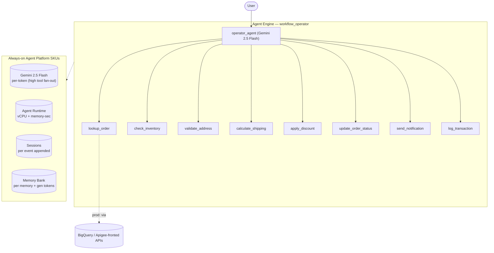

# Workflow Operator — SKU usage & architecture

- **Source:** google/adk-samples · **Model:** gemini-2.5-flash
- **Use case:** Order-fulfillment workflow operator · **Complexity:** Archetype: Workflow Operator / Moderate
- **Unit:** 1 interaction = a 2–5-turn (varying) conversation in a single session, followed by a memory-write step (14.0 model calls on average). All numbers below are averaged over **118 interactions**. Deployed on Vertex AI Agent Engine.
- **Focus:** measured **usage per SKU**; dollar cost is a secondary derived view (§6).

## 1. Architecture

Single agent that drives an order-fulfillment workflow end to end with heavy tool fan-out (archetype: Workflow Operator, Moderate). 8 tools — lookup_order, check_inventory, validate_address, calculate_shipping, apply_discount, update_order_status, send_notification, log_transaction. Tool-fan-out-driven: measured ~14 model calls / ~28 session events per interaction (heavy tool fan-out across the 8 tools). Tools stand in for backend/API calls (Apigee + BigQuery in prod).

**Pattern:** Single agent + heavy tool fan-out (8 tools)

## 2. SKUs (products) consumed

Gemini tokens; Agent Runtime (vCPU + memory); Sessions; Memory Bank. (Backend tool calls mocked — would bill BigQuery + Apigee in production.)

(Sessions and Agent Runtime are billed automatically by Agent Engine; Memory Bank generation is triggered by `add_session_to_memory`. Where the agent uses Google Search grounding or image generation, that usage is reported in §5.)

## 3. How usage was measured

Each interaction = a 2–5-turn (varying) conversation in one session, followed by `add_session_to_memory` (which triggers Memory Bank generation). We ran **118 interactions** to capture run-to-run variability, waited 300s for Cloud Monitoring metrics to settle, then read usage: token counts come from the model's per-response `usage_metadata` (exact — this agent makes no AgentTool-hidden sub-agent calls, so the response stream already sees every model call); runtime (vCPU / memory-seconds) and Memory Bank usage come from Cloud Monitoring (per-engine metrics).

## 4. SKU usage per interaction (PRIMARY)

Measured usage quantities per interaction (averaged over 118 interactions), with the min–max range and variability label across interactions.

| SKU dimension | Unit | Typical | Range | Variability |
|---|---|---|---|---|
| Gemini input tokens | tokens | 20107 | 3343–74345 | High |
| Gemini output tokens (incl. thinking) | tokens | 1485 | 419–3502 | High |
| Gemini tokens — coordinator agent (input) | tokens | 20107 | — | — |
| Gemini tokens — coordinator agent (output) | tokens | 1485 | — | — |
| Gemini tokens — sub-agents (input) | tokens | 0 | — | — |
| Gemini tokens — sub-agents (output) | tokens | 0 | — | — |
| Model calls | calls | 14.0 | — | Medium |
| Agent Runtime — vCPU | vCPU-seconds | 25.3 | — | — |
| Agent Runtime — memory | GiB-seconds | 46.8 | — | — |
| Sessions | events appended | 27.9 | — | Medium |
| Memory Bank — generation | tokens | 2549 | — | — |
| Memory Bank — memories written | memories | 1.1 | — | — |
| Memory Bank — retrievals | reads | 0.7 | — | — |
| Firestore — document writes | writes | 1.42 | — | — |
| Firestore — document reads | reads | 1.23 | — | — |

_**Coordinator vs sub-agent token split** — the share of total Gemini tokens processed by the root coordinator agent versus the sub-agents it delegates to. Measured directly by running the coordinator and the sub-agents on two different model versions (coordinator on gemini-3.5-flash, sub-agents on gemini-3.1-flash-lite) and separating their token counts by model in Cloud Monitoring — this is the **master/sub** split in the two-model measurement. The input-vs-output breakdown within each role is allocated by the measured per-role input:output ratio (coordinator ≈ 88:12, sub-agents ≈ 61:39). Single-agent agents have no sub-agents, so they are 100% coordinator._

## 5. Grounding & media usage

- **Google Search grounding:** none in this workload — the agent does not call `google_search`. (Would bill ~$14 / 1K grounded query-turns if used.)
- **Image generation (Imagen):** none in this workload. (Would bill ~$0.04 / image if used.)

## 5b. Caveats on usage capture

- **Agent Runtime (vCPU / GiB-seconds)** is the engine's allocated compute amortized over the measurement window, so it depends on utilization (queries per hour). Treat it as an upper bound, not actual billed instance-time.
- **Memory storage** (the number of stored memories accruing over time) is not captured here — it is only available from the billing export.
- **Grounding** is counted from the agent's tool calls (Cloud Monitoring's grounding metric is project-wide, with no per-engine label); **Imagen** image counts come from response events.
- **Not yet captured:** Cloud Trace, Cloud Logging, Cloud Storage.

## 6. Secondary: derived cost (usage × catalog list price)

Provided for reference only. List price, not actual billed; **usage above is the primary output.**

| SKU | $/interaction |
|---|---|
| Gemini tokens | 0.0097 |
| Agent Runtime | 0.0029 |
| Memory Bank + Sessions | 0.0081 |
| Firestore (168 writes / 145 reads over 118 interactions) | 0.0000004 |
| Memory Bank retrieval (0.67 memories retrieved/interaction @ $0.5/1K) | 0.000335 |
| Model Armor (derived: 21591 tok scanned @ $0.10/1M) | 0.002159 |
| **Total (measured SKUs)** | **0.0232** (range 0.0132–0.0416) |

## 7. Test workload & sample interactions

Each interaction used a fresh user id. The workload draws from **5 distinct conversation scenarios** of varying length (2–35 turns); real-world conversations differ in length and topic, so cycling several scenarios spreads coverage rather than repeating a single script. Longer interactions repeat these same base scenarios to exercise multi-turn cost scaling.

**Scenario 1** (2 turns):

| Turn | User query |
|---|---|
| 1 | Process order ORD-1001 end to end and apply discount code SAVE10 with express shipping. |
| 2 | Now process order ORD-1003 — flag any issues before shipping. |

**Scenario 2** (3 turns):

| Turn | User query |
|---|---|
| 1 | Process order ORD-1002 with standard shipping. |
| 2 | Apply the WELCOME discount and recalculate shipping. |
| 3 | Send the customer an email confirmation and log it. |

**Scenario 3** (4 turns):

| Turn | User query |
|---|---|
| 1 | Check inventory for the items in order ORD-1001. |
| 2 | Validate the address and calculate express shipping. |
| 3 | Apply SAVE10 and update the status to confirmed. |
| 4 | Notify the customer by SMS and log the transaction. |

**Scenario 4** (4 turns):

| Turn | User query |
|---|---|
| 1 | Look up order ORD-1003 and tell me its current state. |
| 2 | The address issue is fixed — re-validate it. |
| 3 | Calculate standard shipping and apply WELCOME. |
| 4 | Confirm the order and notify by email. |

**Scenario 5** (5 turns):

| Turn | User query |
|---|---|
| 1 | Start processing order ORD-1001. |
| 2 | Check inventory and confirm availability. |
| 3 | Validate the shipping address. |
| 4 | Apply SAVE10 with express shipping and update status. |
| 5 | Notify the customer and write the audit log. |

**Sample interaction (first run):**

- **Turn 1** (10221 in / 849 out tokens) — user: *Process order ORD-1001 end to end and apply discount code SAVE10 with express shipping.*
  - reply preview: Order ORD-1001 processed successfully. - Item: wireless mouse, Quantity: 2 - Inventory: In stock - Address: Valid - Shipping: Express shipping, Cost: $16, ETA: 2 days - Discount: SAVE10 applied (10% o…
- **Turn 2** (10865 in / 593 out tokens) — user: *Now process order ORD-1003 — flag any issues before shipping.*
  - reply preview: Order ORD-1003 cannot be processed at this time due to an issue with the shipping address. Address validation failed because of a "missing ZIP code". Please correct the address before attempting to pr…
