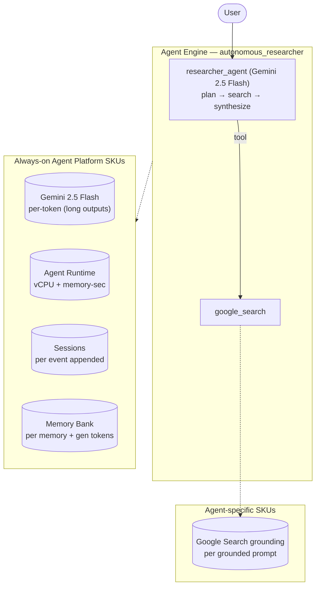

# Autonomous Researcher

**Use case:** Deep web research with synthesis  ·  **Model:** gemini-2.5-flash  ·  **Pattern:** Single agent + Google Search grounding, long outputs
**Measured over 79 interactions** (2–4-turn (varying) conversation, ~8 model calls each).

## Architecture

Deep-research agent (archetype: Autonomous Researcher, Moderate). Plans, grounds on the web via ADK `google_search`, and synthesizes long reports. Token-depth-driven: premium model intent (Gemini Pro), long outputs (~10,700 output tokens/interaction measured), and Search grounding (~69 grounded searches across the run — the first SKU usage that actually exercises Search grounding in this project). Internal-corpus RAG (Vertex AI Search) deferred to the High variant, since google_search must be the sole tool.

## SKU usage per interaction

| SKU dimension | Per-interaction (avg) |
|---|---|
| Gemini input tokens | 32,585 |
| Gemini output tokens (incl. thinking) | 10,739 |
| — coordinator / master tokens | 39,468  (91%) |
| — sub-agent / tool tokens | 3,856  (9%) |
| Model calls | 7.8 |
| Agent Runtime — vCPU-seconds | 171.2 |
| Agent Runtime — memory GiB-seconds | 201 |
| Sessions — events appended | 15.6 |
| Memory Bank — generation tokens | 7,999 |
| Memory Bank — memories retrieved | 0.38 |
| Firestore — document writes / reads | 1.34 / 2.06 |
| Vertex AI Search (RAG) — queries | 1.18 |
| Google Search — grounded turns | 1.62 |

## Derived cost per interaction

| Component | $ / interaction |
|---|---|
| Gemini tokens | 0.036623 |
| Agent Runtime (vCPU + memory) | 0.010115 |
| Memory Bank + Sessions | 0.006482 |
| Firestore | 0.000000 |
| Vertex AI Search (RAG) | 0.001766 |
| Google Search grounding | 0.022684 |
| Memory Bank retrieval | 0.000190 |
| Model Armor (derived: all tokens scanned) | 0.004332 |
| **Total** | **$0.0822** |

## How to read these numbers

- **Usage quantities are the primary output**; the dollar column is a secondary, derived estimate.
- **$ = Cloud Billing Catalog list price**, not actual billed spend (no committed-use or contract discounts).
- **Agent Runtime** (vCPU / GiB-seconds) is amortized allocation time — an **upper bound**, not actual billed instance-time.
- **1 interaction = a 2–4-turn (varying) conversation.**
- **Master / sub token split %** is from a separate two-model measurement (coordinator on gemini-3.5-flash, sub-agents on gemini-3.1-flash-lite); the absolute token totals above are on gemini-2.5-flash.
