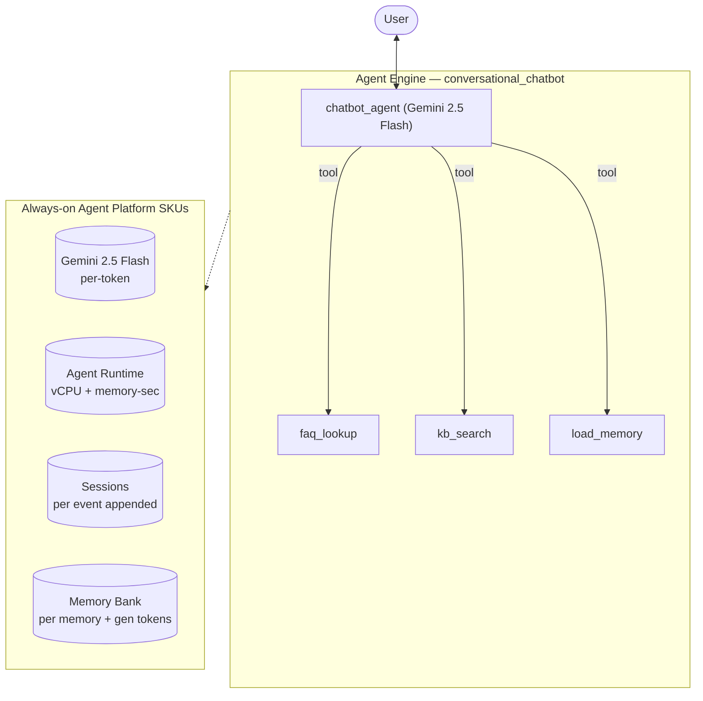

# Conversational Chatbot — SKU usage & architecture

- **Source:** google/adk-samples · **Model:** gemini-2.5-flash
- **Use case:** Customer-support Q&A chatbot · **Complexity:** Archetype: Conversational Chatbot / Moderate
- **Unit:** 1 interaction = 2–5-turn (varying) conversation + memory-write (7.5 model calls avg), averaged over **120 interactions**. Deployed on Vertex AI Agent Engine (GEAP).
- **Focus:** measured **usage per SKU**; dollar cost is a secondary derived view (§6).

## 1. Architecture

Single user-facing support agent (archetype: Conversational Chatbot, Moderate). Light tool use — `faq_lookup` + `kb_search` (stand-ins for a BigQuery/KB lookup) — and `load_memory` for returning-user personalization. Volume-driven archetype: cheap model, short turns. Measured ~7.5 model calls / ~15 session events per interaction.

**Pattern:** Single agent + light tools + Memory Bank

## 2. SKUs (products) consumed

Gemini tokens; Agent Runtime (vCPU + memory); Sessions; Memory Bank. (BigQuery/KB lookup mocked locally — would bill BigQuery in production.)

(Sessions + Agent Runtime are automatic on Agent Engine; Memory Bank generation exercised via add_session_to_memory. Search grounding / Imagen used by the agent but usage not yet metered here — see §7.)

## 3. How usage was measured

Deployed to Agent Engine; per run = 2–5-turn (varying) conversation in one session + add_session_to_memory; **120 runs** for variability; 300s Monitoring settle; token usage from the model response (`usage_metadata`, exact), runtime + Memory Bank usage from Cloud Monitoring (per-engine).

## 4. SKU usage per interaction (PRIMARY)

Measured usage quantities per interaction (avg over 120 runs), with run-to-run range and variability.

| SKU dimension | Unit | Typical | Range | Variability |
|---|---|---|---|---|
| Gemini input tokens | tokens | 6369 | 2030–17874 | High |
| Gemini output tokens (incl. thinking) | tokens | 693 | 185–1876 | High |
| Gemini tokens — master/coordinator (input) | tokens | 6369 | — | — |
| Gemini tokens — master/coordinator (output) | tokens | 693 | — | — |
| Gemini tokens — sub-agents/tools (input) | tokens | 0 | — | — |
| Gemini tokens — sub-agents/tools (output) | tokens | 0 | — | — |
| Model calls | calls | 7.5 | — | Medium |
| Agent Runtime — vCPU | vCPU-seconds | 20.9 | — | — |
| Agent Runtime — memory | GiB-seconds | 38.8 | — | — |
| Sessions | events appended | 15.0 | — | Medium |
| Memory Bank — generation | tokens | 2486 | — | — |
| Memory Bank — memories written | memories | 0.0 | — | — |
| Memory Bank — retrievals | reads | 0.0 | — | — |
| Firestore — document writes | writes | 0.03 | — | — |
| Firestore — document reads | reads | 0.00 | — | — |
| Vertex AI Search (RAG) — queries | searches | 2.15 | — | — |

_Memory retrievals = 0 for this workload. `load_memory` returns memories only when (a) the agent invokes it and (b) earlier sessions generated **user-centric** memories worth recalling. Here it is 0 — the agent has no retrieval tool, or doesn't call it (support-FAQ chatbot answers directly), or calls it but its sessions produce no user-centric memories to retrieve (e.g., academic-research: topic Q&A, not facts about the user). The retrieval SKU IS exercised by financial-advisor, marketing-agency, blog-writer, workflow-operator, autonomous-researcher, and multi-agent-orchestrator (returning-user runs) + `memory_assistant`._

_Master vs sub-agent split: each agent's master/sub token share is measured directly (two-model validation — coordinator on gemini-3.5-flash, sub-agents/tools on gemini-3.1-flash-lite, separated via Cloud Monitoring `token_count` by model). The four input/output × master/sub values reconcile both the master/sub totals and the input/output totals (seeded by the measured per-role in:out ratio — master 88:12, sub 61:39). Single-agent agents are 100% master._

## 5. Grounding & media usage

- **Google Search grounding:** 0 measured. The agent does not use google_search in this workload; would bill ~$14/1K grounded turns if used.
- **Image generation (Imagen):** 0 images measured (from response events). Would bill ~$0.04/image if used.

## 5b. Caveats on usage capture

- vCPU/GiB-seconds are amortized over the measurement window (utilization-dependent).
- Memory storage (stored-memory count over time) is export-only.
- Grounding count is project-wide (no per-engine label); image count is event-based.
- Still uncaptured: Cloud Trace, Logging, Storage.

## 6. Secondary: derived cost (usage × catalog list price)

Provided for reference only. List price, not actual billed; **usage above is the primary output.**

| SKU | $/interaction |
|---|---|
| Gemini tokens | 0.0036 |
| Agent Runtime | 0.0019 |
| Memory Bank + Sessions | 0.0045 |
| Firestore (4w/0r over 120 runs) | 0.0000000 |
| Vertex AI Search (RAG: 2.15 queries/intxn @ $1.50/1K) | 0.003225 |
| Model Armor (derived: 7061 tok scanned @ $0.10/1M) | 0.000706 |
| **Total (measured SKUs)** | **0.0139** (range 0.0074–0.0160) |

## 7. Test workload & sample interactions

**85 interactions** (432 total user turns), fresh user_id per interaction. Interactions cycle **10 distinct conversation scenarios** of varying length (2-turn×16, 3-turn×16, 4-turn×32, 5-turn×16, 16-turn×1, 24-turn×1, 32-turn×2, 40-turn×1) — real-world interactions differ in length and topic, so this spreads coverage rather than repeating one script.

**Scenario 1** (2 turns):

| Turn | User query |
|---|---|
| 1 | How do I reset my password, and what are your support hours? |
| 2 | Also, what are your pricing tiers and do you support SSO? |

**Scenario 2** (3 turns):

| Turn | User query |
|---|---|
| 1 | I'd like a refund on my last order. |
| 2 | How long does that take to process? |
| 3 | Can it go to a different card than I paid with? |

**Scenario 3** (4 turns):

| Turn | User query |
|---|---|
| 1 | Do you integrate with Slack? |
| 2 | What about exporting my data? |
| 3 | Is data export on the Pro tier or Enterprise only? |
| 4 | Okay — how do I upgrade my plan? |

**Scenario 4** (4 turns):

| Turn | User query |
|---|---|
| 1 | My shipment hasn't arrived yet. |
| 2 | It's order ORD-1002. What's the ETA? |
| 3 | Can you switch it to express shipping? |
| 4 | Will I be charged extra for that? |

**Scenario 5** (5 turns):

| Turn | User query |
|---|---|
| 1 | I'm new — can you walk me through setting up my account? |
| 2 | How do I invite my team? |
| 3 | What roles can I assign them? |
| 4 | Do you support SSO for the team? |
| 5 | And what does all that cost on the Pro tier? |

**Scenario 6** (16 turns):

| Turn | User query |
|---|---|
| 1 | How do I reset my password, and what are your support hours? |
| 2 | Also, what are your pricing tiers and do you support SSO? |
| 3 | How do I reset my password, and what are your support hours? |
| 4 | Also, what are your pricing tiers and do you support SSO? |
| 5 | How do I reset my password, and what are your support hours? |
| 6 | Also, what are your pricing tiers and do you support SSO? |
| 7 | How do I reset my password, and what are your support hours? |
| 8 | Also, what are your pricing tiers and do you support SSO? |
| 9 | How do I reset my password, and what are your support hours? |
| 10 | Also, what are your pricing tiers and do you support SSO? |
| 11 | How do I reset my password, and what are your support hours? |
| 12 | Also, what are your pricing tiers and do you support SSO? |
| 13 | How do I reset my password, and what are your support hours? |
| 14 | Also, what are your pricing tiers and do you support SSO? |
| 15 | How do I reset my password, and what are your support hours? |
| 16 | Also, what are your pricing tiers and do you support SSO? |

**Scenario 7** (24 turns):

| Turn | User query |
|---|---|
| 1 | I'd like a refund on my last order. |
| 2 | How long does that take to process? |
| 3 | Can it go to a different card than I paid with? |
| 4 | I'd like a refund on my last order. |
| 5 | How long does that take to process? |
| 6 | Can it go to a different card than I paid with? |
| 7 | I'd like a refund on my last order. |
| 8 | How long does that take to process? |
| 9 | Can it go to a different card than I paid with? |
| 10 | I'd like a refund on my last order. |
| 11 | How long does that take to process? |
| 12 | Can it go to a different card than I paid with? |
| 13 | I'd like a refund on my last order. |
| 14 | How long does that take to process? |
| 15 | Can it go to a different card than I paid with? |
| 16 | I'd like a refund on my last order. |
| 17 | How long does that take to process? |
| 18 | Can it go to a different card than I paid with? |
| 19 | I'd like a refund on my last order. |
| 20 | How long does that take to process? |
| 21 | Can it go to a different card than I paid with? |
| 22 | I'd like a refund on my last order. |
| 23 | How long does that take to process? |
| 24 | Can it go to a different card than I paid with? |

**Scenario 8** (32 turns):

| Turn | User query |
|---|---|
| 1 | Do you integrate with Slack? |
| 2 | What about exporting my data? |
| 3 | Is data export on the Pro tier or Enterprise only? |
| 4 | Okay — how do I upgrade my plan? |
| 5 | Do you integrate with Slack? |
| 6 | What about exporting my data? |
| 7 | Is data export on the Pro tier or Enterprise only? |
| 8 | Okay — how do I upgrade my plan? |
| 9 | Do you integrate with Slack? |
| 10 | What about exporting my data? |
| 11 | Is data export on the Pro tier or Enterprise only? |
| 12 | Okay — how do I upgrade my plan? |
| 13 | Do you integrate with Slack? |
| 14 | What about exporting my data? |
| 15 | Is data export on the Pro tier or Enterprise only? |
| 16 | Okay — how do I upgrade my plan? |
| 17 | Do you integrate with Slack? |
| 18 | What about exporting my data? |
| 19 | Is data export on the Pro tier or Enterprise only? |
| 20 | Okay — how do I upgrade my plan? |
| 21 | Do you integrate with Slack? |
| 22 | What about exporting my data? |
| 23 | Is data export on the Pro tier or Enterprise only? |
| 24 | Okay — how do I upgrade my plan? |
| 25 | Do you integrate with Slack? |
| 26 | What about exporting my data? |
| 27 | Is data export on the Pro tier or Enterprise only? |
| 28 | Okay — how do I upgrade my plan? |
| 29 | Do you integrate with Slack? |
| 30 | What about exporting my data? |
| 31 | Is data export on the Pro tier or Enterprise only? |
| 32 | Okay — how do I upgrade my plan? |

**Scenario 9** (32 turns):

| Turn | User query |
|---|---|
| 1 | My shipment hasn't arrived yet. |
| 2 | It's order ORD-1002. What's the ETA? |
| 3 | Can you switch it to express shipping? |
| 4 | Will I be charged extra for that? |
| 5 | My shipment hasn't arrived yet. |
| 6 | It's order ORD-1002. What's the ETA? |
| 7 | Can you switch it to express shipping? |
| 8 | Will I be charged extra for that? |
| 9 | My shipment hasn't arrived yet. |
| 10 | It's order ORD-1002. What's the ETA? |
| 11 | Can you switch it to express shipping? |
| 12 | Will I be charged extra for that? |
| 13 | My shipment hasn't arrived yet. |
| 14 | It's order ORD-1002. What's the ETA? |
| 15 | Can you switch it to express shipping? |
| 16 | Will I be charged extra for that? |
| 17 | My shipment hasn't arrived yet. |
| 18 | It's order ORD-1002. What's the ETA? |
| 19 | Can you switch it to express shipping? |
| 20 | Will I be charged extra for that? |
| 21 | My shipment hasn't arrived yet. |
| 22 | It's order ORD-1002. What's the ETA? |
| 23 | Can you switch it to express shipping? |
| 24 | Will I be charged extra for that? |
| 25 | My shipment hasn't arrived yet. |
| 26 | It's order ORD-1002. What's the ETA? |
| 27 | Can you switch it to express shipping? |
| 28 | Will I be charged extra for that? |
| 29 | My shipment hasn't arrived yet. |
| 30 | It's order ORD-1002. What's the ETA? |
| 31 | Can you switch it to express shipping? |
| 32 | Will I be charged extra for that? |

**Scenario 10** (40 turns):

| Turn | User query |
|---|---|
| 1 | I'm new — can you walk me through setting up my account? |
| 2 | How do I invite my team? |
| 3 | What roles can I assign them? |
| 4 | Do you support SSO for the team? |
| 5 | And what does all that cost on the Pro tier? |
| 6 | I'm new — can you walk me through setting up my account? |
| 7 | How do I invite my team? |
| 8 | What roles can I assign them? |
| 9 | Do you support SSO for the team? |
| 10 | And what does all that cost on the Pro tier? |
| 11 | I'm new — can you walk me through setting up my account? |
| 12 | How do I invite my team? |
| 13 | What roles can I assign them? |
| 14 | Do you support SSO for the team? |
| 15 | And what does all that cost on the Pro tier? |
| 16 | I'm new — can you walk me through setting up my account? |
| 17 | How do I invite my team? |
| 18 | What roles can I assign them? |
| 19 | Do you support SSO for the team? |
| 20 | And what does all that cost on the Pro tier? |
| 21 | I'm new — can you walk me through setting up my account? |
| 22 | How do I invite my team? |
| 23 | What roles can I assign them? |
| 24 | Do you support SSO for the team? |
| 25 | And what does all that cost on the Pro tier? |
| 26 | I'm new — can you walk me through setting up my account? |
| 27 | How do I invite my team? |
| 28 | What roles can I assign them? |
| 29 | Do you support SSO for the team? |
| 30 | And what does all that cost on the Pro tier? |
| 31 | I'm new — can you walk me through setting up my account? |
| 32 | How do I invite my team? |
| 33 | What roles can I assign them? |
| 34 | Do you support SSO for the team? |
| 35 | And what does all that cost on the Pro tier? |
| 36 | I'm new — can you walk me through setting up my account? |
| 37 | How do I invite my team? |
| 38 | What roles can I assign them? |
| 39 | Do you support SSO for the team? |
| 40 | And what does all that cost on the Pro tier? |

**Sample interaction (first run):**

- **Turn 1** (963 in / 231 out tokens) — user: *How do I reset my password, and what are your support hours?*
  - reply preview: I don't have information on how to reset your password or our support hours in my frequently asked questions. Would you like me to try and find this information elsewhere, or escalate your request to …
- **Turn 2** (1743 in / 525 out tokens) — user: *Also, what are your pricing tiers and do you support SSO?*
  - reply preview: We have a free Starter tier (1 user, community support). Our Pro tier is $29/user/month and includes API access but not SSO. The Enterprise tier is custom-priced and includes SSO, SLA, and dedicated s…
