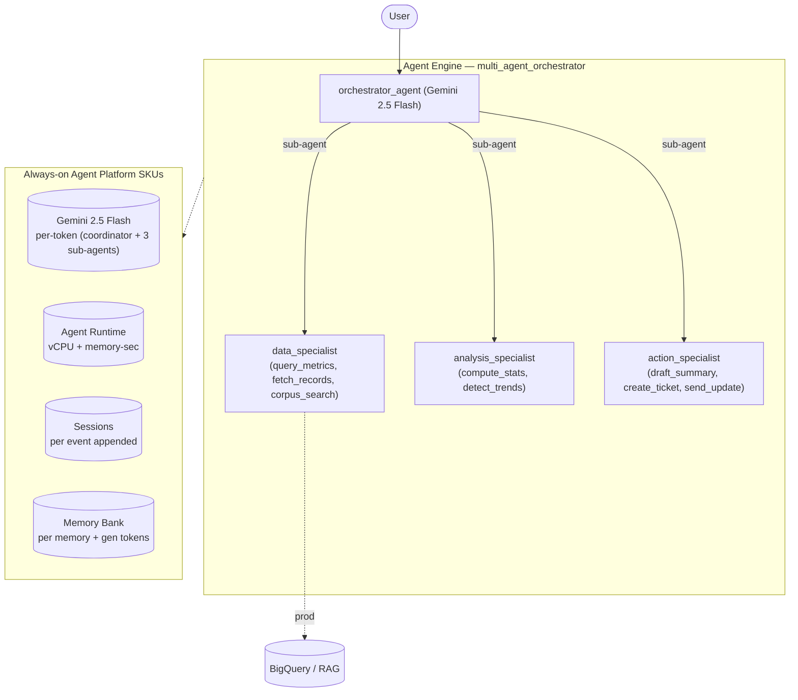

# Multi-Agent Orchestrator

**Use case:** Decompose-and-delegate orchestration  ·  **Model:** gemini-2.5-flash  ·  **Pattern:** Coordinator + 3 specialist sub-agents (agent-call fan-out)
**Measured over 120 interactions** (2–5-turn (varying) conversation, ~19 model calls each).

## Architecture

Coordinator that decomposes a request and delegates to 3 specialist sub-agents — data_specialist (metrics / records / corpus), analysis_specialist (stats / trends), action_specialist (summary / ticket / notify) (archetype: Multi-Agent Orchestrator, Moderate). Fan-out-driven and the most expensive of the four archetypes: heavy input from context re-ingestion across sub-agents, ~19 model calls and ~38 session events per interaction (coordinator + sub-agent token multiplication). Specialist tools are local stand-ins for BigQuery / RAG.

## SKU usage per interaction

| SKU dimension | Per-interaction (avg) |
|---|---|
| Gemini input tokens | 149,080 |
| Gemini output tokens (incl. thinking) | 6,080 |
| — coordinator / master tokens | 26,067  (17%) |
| — sub-agent / tool tokens | 129,093  (83%) |
| Model calls | 18.9 |
| Agent Runtime — vCPU-seconds | 90.6 |
| Agent Runtime — memory GiB-seconds | 100 |
| Sessions — events appended | 37.9 |
| Memory Bank — generation tokens | 2,793 |
| Memory Bank — memories retrieved | 0.20 |
| Firestore — document writes / reads | 0.29 / 0.63 |
| Vertex AI Search (RAG) — queries | 0.42 |

## Derived cost per interaction

| Component | $ / interaction |
|---|---|
| Gemini tokens | 0.059900 |
| Agent Runtime (vCPU + memory) | 0.006672 |
| Memory Bank + Sessions | 0.010411 |
| Firestore | 0.000000 |
| Vertex AI Search (RAG) | 0.000625 |
| Memory Bank retrieval | 0.000100 |
| Model Armor (derived: all tokens scanned) | 0.015516 |
| **Total** | **$0.0932** |

## How to read these numbers

- **Usage quantities are the primary output**; the dollar column is a secondary, derived estimate.
- **$ = Cloud Billing Catalog list price**, not actual billed spend (no committed-use or contract discounts).
- **Agent Runtime** (vCPU / GiB-seconds) is amortized allocation time — an **upper bound**, not actual billed instance-time.
- **1 interaction = a 2–5-turn (varying) conversation.**
- **Master / sub token split %** is from a separate two-model measurement (coordinator on gemini-3.5-flash, sub-agents on gemini-3.1-flash-lite); the absolute token totals above are on gemini-2.5-flash.
