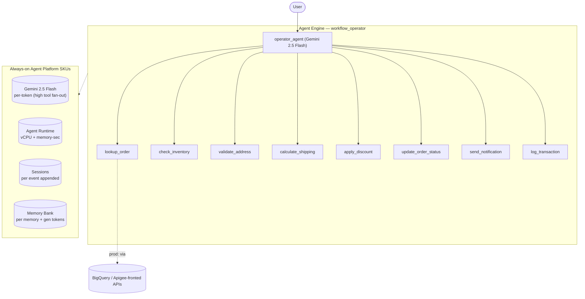

# Workflow Operator

**Use case:** Order-fulfillment workflow operator  ·  **Model:** gemini-2.5-flash  ·  **Pattern:** Single agent + heavy tool fan-out (8 tools)
**Measured over 118 interactions** (2–5-turn (varying) conversation, ~14 model calls each).

## Architecture

Single agent that drives an order-fulfillment workflow end to end with heavy tool fan-out (archetype: Workflow Operator, Moderate). 8 tools — lookup_order, check_inventory, validate_address, calculate_shipping, apply_discount, update_order_status, send_notification, log_transaction. Tool-fan-out-driven: measured ~14 model calls / ~28 session events per interaction (heavy tool fan-out across the 8 tools). Tools stand in for backend/API calls (Apigee + BigQuery in prod).

## SKU usage per interaction

| SKU dimension | Per-interaction (avg) |
|---|---|
| Gemini input tokens | 20,107 |
| Gemini output tokens (incl. thinking) | 1,485 |
| — coordinator / sub split | 100% coordinator (single-agent) |
| Model calls | 14.0 |
| Agent Runtime — vCPU-seconds | 25.3 |
| Agent Runtime — memory GiB-seconds | 47 |
| Sessions — events appended | 27.9 |
| Memory Bank — generation tokens | 2,549 |
| Memory Bank — memories retrieved | 0.67 |
| Firestore — document writes / reads | 1.42 / 1.23 |

## Derived cost per interaction

| Component | $ / interaction |
|---|---|
| Gemini tokens | 0.009700 |
| Agent Runtime (vCPU + memory) | 0.002944 |
| Memory Bank + Sessions | 0.008087 |
| Firestore | 0.000000 |
| Memory Bank retrieval | 0.000335 |
| Model Armor (derived: all tokens scanned) | 0.002159 |
| **Total** | **$0.0232** |

## How to read these numbers

- **Usage quantities are the primary output**; the dollar column is a secondary, derived estimate.
- **$ = Cloud Billing Catalog list price**, not actual billed spend (no committed-use or contract discounts).
- **Agent Runtime** (vCPU / GiB-seconds) is amortized allocation time — an **upper bound**, not actual billed instance-time.
- **1 interaction = a 2–5-turn (varying) conversation.**
